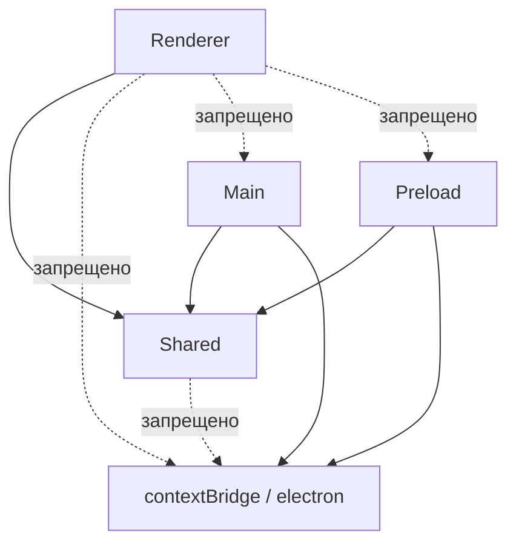

# Архитектура Main / Preload / Renderer

Границы слоёв SystemDeck, зафиксированные в SD-002.

## Слои

- **Main** (`src/main/`) — Node-процесс, владеет `BrowserWindow`, жизненным циклом `app`, `shell`, `ipcMain`. Имеет доступ к Privileged API.
- **Preload** (`src/preload/`) — единственный мост с `contextBridge`. Импортирует `electron` (contextBridge) и `Shared`, экспонит `window.api`.
- **Renderer** (`src/renderer/`) — React UI, `tsconfig.web.json`, без доступа к Node/Electron. Импортирует только `Shared` и свой код.
- **Shared** (`src/shared/`) — кросс-слойные контракты: `type`/`interface` и `const` литералы, без runtime `electron` / `node:*`. Импортируется всеми слоями, сам никого не импортирует из слоёв.

## Граф зависимостей



## Разрешённые направления (таблица)

| Импортёр | Может импортировать | Запрещено |
|----------|---------------------|-----------|
| `src/main/**` | `src/shared/**`, `electron`, `node:*`, `@electron-toolkit/*` | `src/renderer/**`, `src/preload/**` (кроме preload пути в `webPreferences`) |
| `src/preload/**` | `src/shared/**`, `electron` (`contextBridge`) | `src/main/**`, `src/renderer/**`, `node:fs` вне необходимости |
| `src/renderer/**` | `src/shared/**`, `react`, `vite` | `electron`, `node:*`, `src/main/**`, `src/preload/**` |
| `src/shared/**` | типы/`const`/`as const` + чистые хелперы без runtime (`toIpcError`, `ipcSuccess`/`ipcFailure`, `isIpcError`) | `electron`, `node:*`, любой слой |

Enforcement на SD-002: раздельные `tsconfig` (project references), алиасы `@shared/*` + `@renderer/*`, документация + автоматическая проверка `npm run check:boundaries` (`scripts/check-boundaries.mjs` — Renderer -/-> `electron`/`node:*`/`@electron-toolkit`, Shared -/-> `electron`/`node:*`, `contextBridge` только в `src/preload`). Проверка встроена в `npm run build`. Полный линт (`no-restricted-imports`, `dependency-cruiser`, формат) вводится в SD-004.

## Безопасность окна

`src/main/index.ts` создаёт `BrowserWindow` с:

```ts
webPreferences: {
  preload: join(__dirname, '../preload/index.js'),
  contextIsolation: true,
  nodeIntegration: false,
  sandbox: true
}
```

`contextIsolation: true` + `nodeIntegration: false` + `sandbox: true` — дефолты SD-002 (см. ADR 0002). Renderer не получает `require`, весь доступ через `window.api`.

## Preload-контракт

- Единственное место с `contextBridge.exposeInMainWorld`.
- Экспонит только `window.api: AppAPI` (тип из `src/shared/api.ts`), пока пустой — расширяется в SD-003.
- `window.electron` (`electronAPI` из `@electron-toolkit/preload`) **не** экспонится начиная с SD-002.
- Типы окна — `src/preload/index.d.ts` (`interface Window { api: AppAPI }`), включается в `tsconfig.web.json`.

## Shared-контракт

- `src/shared/api.ts` — `export interface AppAPI {}` (минимальный контракт SD-002, в SD-003 `AppAPI.ping` выведен из `IpcContracts` через `IpcResultFor<typeof IPC_CHANNELS.ping>`) + `SHARED_CONTRACT_VERSION`, `src/shared/index.ts` — barrel (`@shared` entry point).
- Разрешено: `type`, `interface`, `const` строк-литералов, `as const` объекты + чистые хелперы без `electron`/`node:*` (`IpcResult`/`IpcError`, `IPC_ERROR_CODES`, `isIpcError`/`toIpcError`/`ipcSuccess`/`ipcFailure`, `IpcContracts` + `IpcRequest`/`IpcResponse`/`IpcResultFor`).
- Запрещено: `import 'electron'`, `import 'node:*'`, runtime зависимости от Electron. Проверка: `npm run check:boundaries` и `grep -r "from 'electron'" src/shared` — пусто.
- Алиас `@shared/*` резолвится в `tsconfig.node.json`, `tsconfig.web.json` и `electron.vite.config.ts` (main/preload/renderer).

## Проверки

```bash
npm run typecheck        # tsc по обоим проектам
npm run check:boundaries # границы слоёв (Renderer/Shared/contextBridge)
npm run build            # typecheck + check:boundaries + electron-vite build
```

## Дальше

- SD-003 — типизированные IPC: имена каналов и `request/response` типы в `Shared`, `ipcMain.handle` в Main, `ipcRenderer.invoke` только через Preload.
- SD-004 — `eslint` `no-restricted-imports` + `dependency-cruiser` + формат/тесты (расширяет `check:boundaries`).
